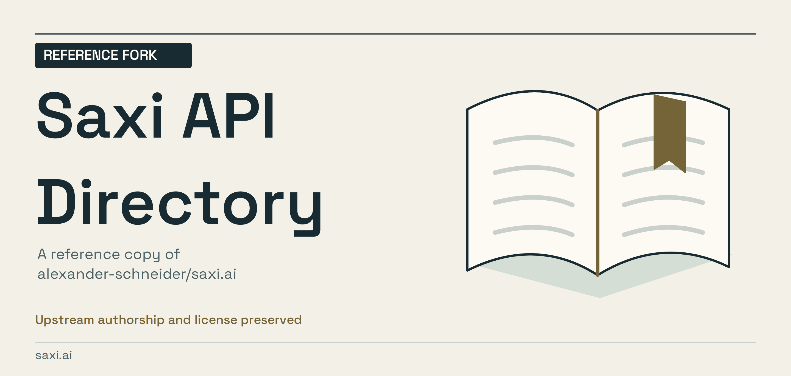
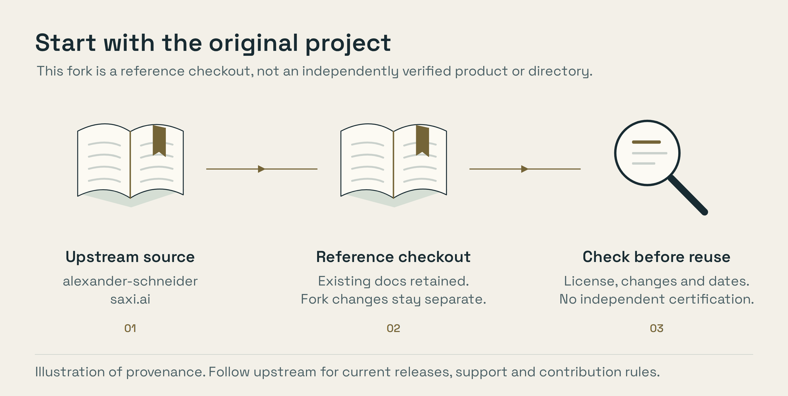

<!-- repository-presentation: reference-fork -->

# Saxi API Directory / reference fork

This repository is a fork of **[alexander-schneider/saxi.ai](https://github.com/alexander-schneider/saxi.ai)**. The original project's
authors, licensing and contribution rules still apply. This presentation does
not claim the upstream work as an original project.

- Start with the [upstream repository](https://github.com/alexander-schneider/saxi.ai) for its current documentation.
- Review this fork's history before assuming it is identical to the latest upstream branch.
- Check licenses and current service behavior before using code, providers or resources.

*Provenance illustration, not an execution trace. [Editable artwork](scripts/artwork/README.md).*

## Existing project documentation

The documentation below is preserved from this fork's previous public revision.
Counts, service claims, badges and benchmark statements in that material are
not independently certified by this presentation pass. No upstream release,
security or availability guarantee is being added.

---

# saxi.ai

  

Broad public API directory with a strong AI and agent focus.

V1 is intentionally simple:

- static, build-time rendered pages
- Cloudflare Worker + static assets
- public APIs with availability metadata
- multiple public GitHub sources
- strong category and capability landing pages
- lightweight client-side search on top of a crawlable archive

## Stack

- TypeScript for the Worker and build pipeline
- Tailwind CSS v4
- vanilla browser JavaScript for search/filter behavior
- Wrangler for Cloudflare deployment

## Data sources

- `public-api-lists/public-api-lists`
- `public-apis/public-apis`
- `tools-collection/apis-collection`

The build reads versioned snapshots from `data/vendor/` instead of fetching these sources live. Run
`npm run sources:refresh` to update the snapshots from upstream.

## Scripts

- `npm run build` builds the full static site into `dist/`
- `npm run typecheck` runs TypeScript checks
- `npm run check` runs type checks plus `wrangler types --check`
- `npm run cf:typegen` regenerates `worker-configuration.d.ts`
- `npm run sources:refresh` refreshes versioned API source snapshots in `data/vendor/`
- `npm run dev` builds the site, then starts Wrangler local development
- `npm run audit:links` audits all target docs URLs with 10 parallel workers and refreshes the ignore list
- `npm run screenshots:capture` captures up to 60 missing or stale real screenshots into `.cache/screenshots` using Playwright

## Screenshots

V1 supports two modes:

- default: generated SVG placeholders for every API entry
- local/CI capture mode: `npm run screenshots:capture` renders real screenshots with Playwright into `.cache/screenshots/`
- optional remote mode: if `SCREENSHOT_API_BASE_URL` is provided, the build tries to fetch real screenshots and caches them in `.cache/screenshots/`

If remote screenshot capture is unavailable, the build does not fail.

Recommended production path:

- run `npm run audit:links` first, so dead targets land in `data/api-ignore-list.json`
- run `npm run screenshots:capture -- --concurrency=5 --limit=60 --stale-days=90`
- then run `npm run build`

The deploy workflow restores and saves `.cache/screenshots`, installs Chromium, refreshes a bounded batch of up to 60 missing screenshots plus screenshots older than 90 days, and then deploys.

## Deploy

The repository includes GitHub Actions workflows for CI and Cloudflare deployment.

Required secrets for deploy:

- `CLOUDFLARE_API_TOKEN`
- `CLOUDFLARE_ACCOUNT_ID`

Optional screenshot-related secrets:

- `SCREENSHOT_API_BASE_URL`
- `SCREENSHOT_API_TOKEN`
